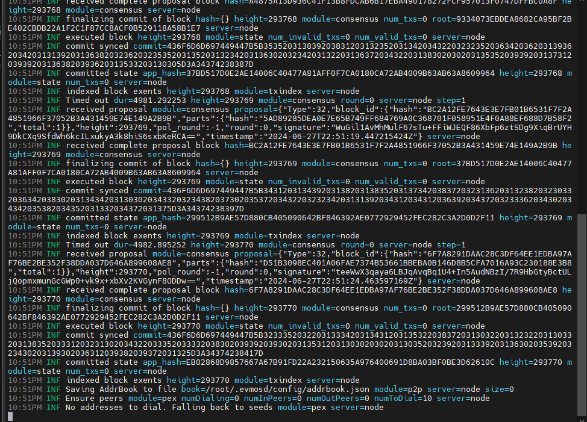

import Image from 'next/image'

## Spesfikasi

Minimum: 2 vCPU 4 RAM

Requirements: 4vCPU 8 RAM

### Install Dependecies & GO

```js copy
apt update && apt upgrade -y
sudo apt install -y curl git jq lz4 build-essential cmake perl automake autoconf libtool wget libssl-dev
```

```js copy
sudo rm -rf /usr/local/go
curl -L https://go.dev/dl/go1.22.3.linux-amd64.tar.gz | sudo tar -xzf - -C /usr/local
echo 'export PATH=$PATH:/usr/local/go/bin:$HOME/go/bin' >> $HOME/.bash_profile
source .bash_profile
```

### Clone Airchain Repo

```js copy
git clone https://github.com/airchains-network/evm-station.git
git clone https://github.com/airchains-network/tracks.git
```
### Run Evmos

```js copy
cd evm-station
go mod tidy
```

```js copy
/bin/bash ./scripts/local-setup.sh
```

```js copy
nano ~/.rollup-env
```

```js copy
MONIKER="localtestnet"
KEYRING="test"
KEYALGO="eth_secp256k1"
LOGLEVEL="info"
HOMEDIR="$HOME/.evmosd"
TRACE=""
BASEFEE=1000000000
CONFIG=$HOMEDIR/config/config.toml
APP_TOML=$HOMEDIR/config/app.toml
GENESIS=$HOMEDIR/config/genesis.json
TMP_GENESIS=$HOMEDIR/config/tmp_genesis.json
VAL_KEY="mykey"
```

```js copy
sudo tee /etc/systemd/system/rolld.service > /dev/null << EOF
[Unit]
Description=ZK
After=network.target

[Service]
User=root
EnvironmentFile=/root/.rollup-env
ExecStart=/root/evm-station/build/station-evm start --metrics "" --log_level info --json-rpc.api eth,txpool,personal,net,debug,web3 --chain-id "stationevm_1234-1"
Restart=always
RestartSec=3

[Install]
WantedBy=multi-user.target
EOF
```

```js copy
sudo systemctl daemon-reload
sudo systemctl enable rolld
sudo systemctl start rolld
sudo journalctl -u rolld -f --no-hostname -o cat
```


