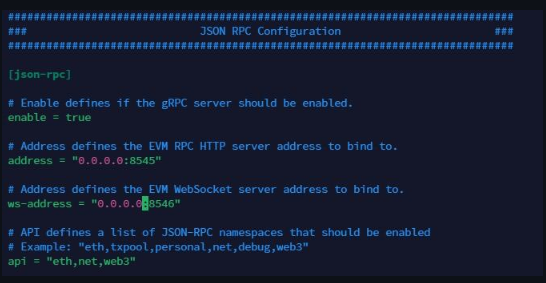
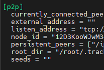
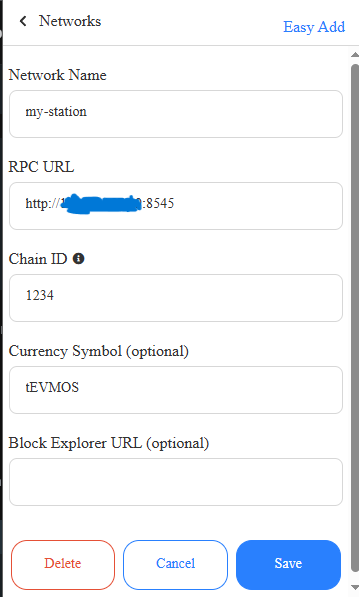

import Image from 'next/image'
import { Callout } from 'nextra/components'

## Spesfikasi

Minimum: 2 vCPU 4 RAM

Requirements: 4vCPU 8 RAM

### Install Dependecies & GO

```js copy
apt update && apt upgrade -y
sudo apt install -y curl git jq lz4 build-essential cmake perl automake autoconf libtool wget libssl-dev
```

```js copy
sudo rm -rf /usr/local/go
curl -L https://go.dev/dl/go1.22.3.linux-amd64.tar.gz | sudo tar -xzf - -C /usr/local
echo 'export PATH=$PATH:/usr/local/go/bin:$HOME/go/bin' >> $HOME/.bash_profile
source .bash_profile
```

### Clone Airchain Repo

```js copy
git clone https://github.com/airchains-network/evm-station.git
git clone https://github.com/airchains-network/tracks.git
```
### Run Evmos

```js copy
cd evm-station
go mod tidy
```

```js copy
/bin/bash ./scripts/local-setup.sh
```

```js copy
nano ~/.rollup-env
```

```js copy
MONIKER="localtestnet"
KEYRING="test"
KEYALGO="eth_secp256k1"
LOGLEVEL="info"
HOMEDIR="$HOME/.evmosd"
TRACE=""
BASEFEE=1000000000
CONFIG=$HOMEDIR/config/config.toml
APP_TOML=$HOMEDIR/config/app.toml
GENESIS=$HOMEDIR/config/genesis.json
TMP_GENESIS=$HOMEDIR/config/tmp_genesis.json
VAL_KEY="mykey"
```

```js copy
sudo tee /etc/systemd/system/rolld.service > /dev/null << EOF
[Unit]
Description=ZK
After=network.target

[Service]
User=root
EnvironmentFile=/root/.rollup-env
ExecStart=/root/evm-station/build/station-evm start --metrics "" --log_level info --json-rpc.api eth,txpool,personal,net,debug,web3 --chain-id "stationevm_1234-1"
Restart=always
RestartSec=3

[Install]
WantedBy=multi-user.target
EOF
```

```js copy
sudo systemctl daemon-reload
sudo systemctl enable rolld
sudo systemctl start rolld
sudo journalctl -u rolld -f --no-hostname -o cat
```


```js copy
systemctl stop rolld
```

```js copy
nano ~/.evmosd/config/app.toml
```

edit config same my screenshot



```js copy
systemctl restart rolld
```

```js copy
/bin/bash ./scripts/local-keys.sh
```
<Callout type="warning" emoji="⚠️">
  NOTED: Save this Private KEYS, and Import to Metamask
</Callout>

### Clone EigenDA
if you want other chain, clestia and avail you can use official doc.

read this (https://docs.airchains.io/rollups/evm-zk-rollup/create-an-evm-zk-rollup)


```js copy
cd $HOME
wget https://github.com/airchains-network/tracks/releases/download/v0.0.2/eigenlayer
mkdir -p $HOME/go/bin
chmod +x $HOME/eigenlayer
mv $HOME/eigenlayer $HOME/go/bin
```

```js copy

eigenlayer operator keys create --key-type ecdsa WALLETNAME

```

<Callout type="warning" emoji="⚠️">
- Change `WALLETNAME` and save the Private Key given to you in the output.
- Close with Ctrl+c, enter and note the other `public hex` given, you will need it.
</Callout>

```js copy
cd $HOME
cd tracks
go mod tidy
```

```js copy
go run cmd/main.go init --daRpc "disperser-holesky.eigenda.xyz" --daKey "PUBLICHEX" --daType "eigen" --moniker "MONIKER" --stationRpc "http://127.0.0.1:8545" --stationAPI "http://127.0.0.1:8545" --stationType "evm"
```
### Create tracking address

Now we create a tracking address. Change from WALLETNAME.

```js copy
go run cmd/main.go keys junction --accountName WALLETNAME --accountPath $HOME/.tracks/junction-accounts/keys
```

if you want import your pharse you can use comand

```js copy

go run cmd/main.go keys import --accountName WALLETNAME --accountPath $HOME/.tracks/junction-accounts/keys

```

<Callout type="warning" emoji="⚠️">

- Change `WALLETNAME` and save the Private Key given to you in the output.
- Close with Ctrl+c, enter and note the other `public hex` given, you will need it.

</Callout>

```js copy
go run cmd/main.go prover v1EVM
```

```js copy
nano ~/.tracks/config/sequencer.toml
```
<Callout type="warning" emoji="⚠️">
copy node_id
</Callout>



```js copy
go run cmd/main.go create-station --accountName WALLETNAME --accountPath $HOME/.tracks/junction-accounts/keys --jsonRPC "https://junction-testnet-rpc.synergynodes.com/" --info "EVM Track" --tracks ADDRESS-AIRCHAIN --bootstrapNode "/ip4/IP/tcp/2300/p2p/NODEID"
```
<Callout type="warning" emoji="⚠️">
- Change `WALLETNAME`
- Change `ADDRESS-AIRCHAIN`
- Change `IP`
- Change `Node_id`
</Callout>

We have the station ready, now let's run

```js copy
sudo tee /etc/systemd/system/stationd.service > /dev/null << EOF
[Unit]
Description=station track service
After=network-online.target
[Service]
User=root
WorkingDirectory=/root/tracks/
ExecStart=/usr/local/go/bin/go run cmd/main.go start
Restart=always
RestartSec=3
LimitNOFILE=65535
[Install]
WantedBy=multi-user.target
EOF
```
```js copy
screen -R station
sudo systemctl daemon-reload
sudo systemctl enable stationd
sudo systemctl restart stationd
sudo journalctl -u stationd -f --no-hostname -o cat
```

## installation complete?

That's the whole installation process. But you don't get any points this time. We import your Tracker wallet mnemonic into jump wallet and click https://points.airchains.io/ connect. You can see your stations and points on the dashboard. Because we haven't created a tx yet, 100 pending points will appear. The reason is that you need to take out the pods to get points. You can think of it as a package consisting of 25tx pods. Every 25tx will extract 1 pod and you will get 5 points from this transaction. 100 points on first installation will be active after first pod.

For this, we do the following. First, we get the priv key with the command `bin/bash ./scripts/local-keys.sh` and set rpc. We import this private key into Metamaska, enter the following information in the add network section.

### Costum Network METAMASK

```js copy
rpc http://YOUT-IP:8545

id 1234

ticker tEVMOS
```



### Open Port

```js copy
sudo ufw allow 8545
```

<Callout type="info" emoji="ℹ️">
Those who get an rpc error during the track process should try to rollback. Sometimes the problem is solved with 1, sometimes 3 rollback operations. Run the command go run cmd/main.go rollback as many times as you want to rollback, waiting for the results each time.
</Callout>

```js copy
systemctl stop stationd
cd tracks
go run cmd/main.go rollback
sudo systemctl restart stationd
sudo journalctl -u stationd -f --no-hostname -o cat
```

### FINALLY 
See your point in WEB https://points.airchains.io/


