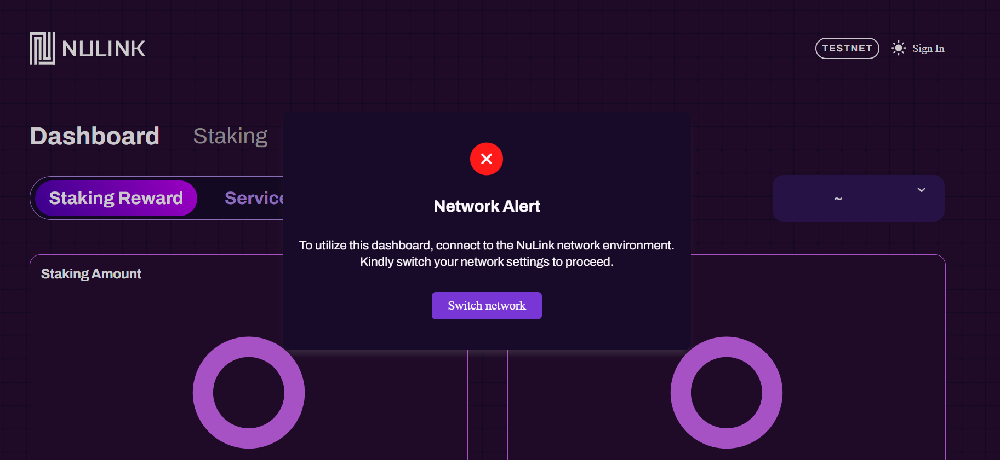
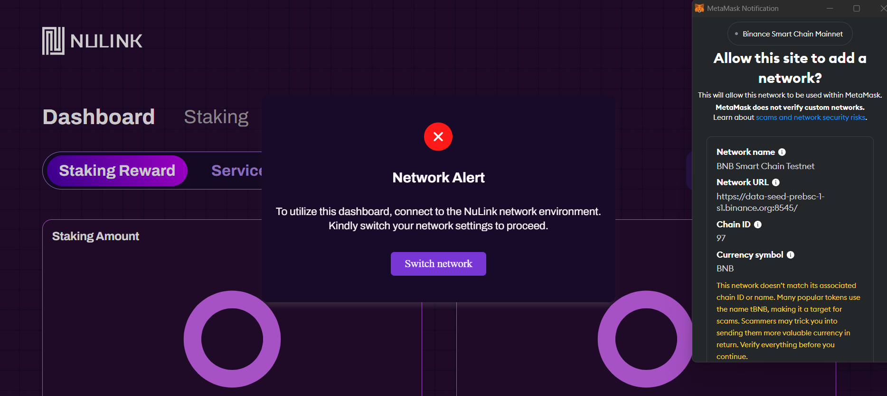
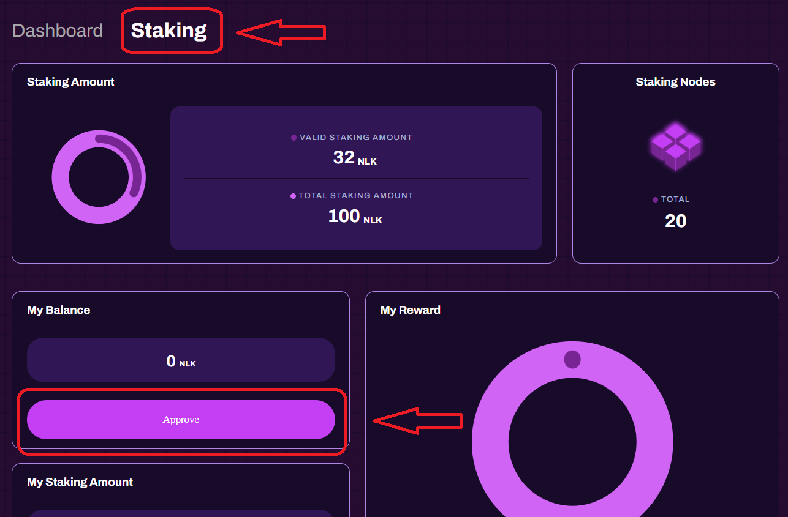
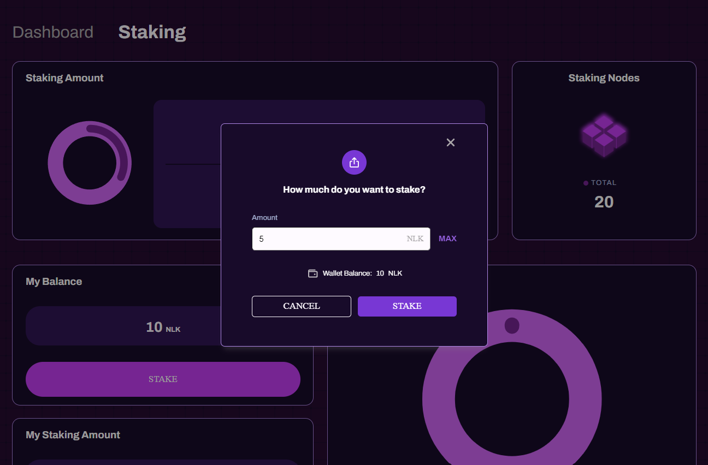
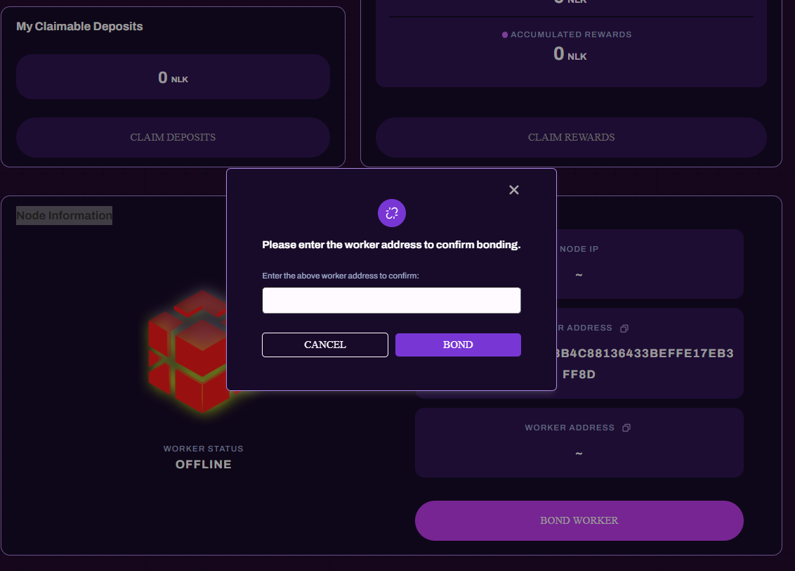
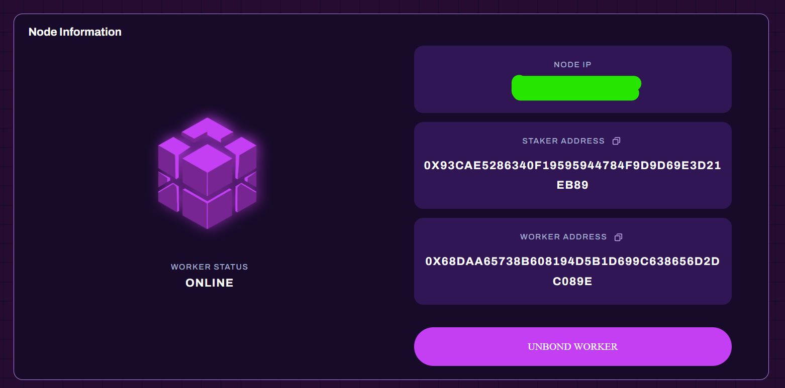

import Image from 'next/image'
import { Steps } from 'nextra/components'

# Staking Process Steps

For information about other features of the platform, please check here (https://docs.nulink.org/products/stakers).

After creating a worker account, please see the following guide for staking

<Steps>

### Go to NuLink.

Go to (https://dashboard.testnet.nulink.org/). You will be greeted with a network warning. Log in to the platform with your Metamask address.

### Connect wallet

You will be prompted to add the BNB Smart Chain Testnet network to your metamask and once you agree, the BNB Smart Chain Testnet network will be automatically added to your metamask. This warning will not appear if you have already added the BNB Smart Chain Testnet network to your metamask.

### Click on the wallet icon 

on the top right and claim the test tokens. First claim the Tbnb token, second claim the Nlk token. If you encounter a problem when requesting test tokens then try other browsers

### GO to staking

After requesting the test tokens, enter the Staking section and click Approve in My Balance

### stake

After Approve, the button for staking will be active and you can do the staking.

###  Go to the Node Information

section below and click on the Bond worker button. Paste your worker address here and click on the Bond button.

### FINAL

And the final. If you have a smooth node installation and staking process, you will soon have an image like below.

# CONGRATULATION

</Steps>