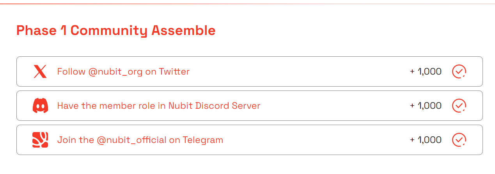
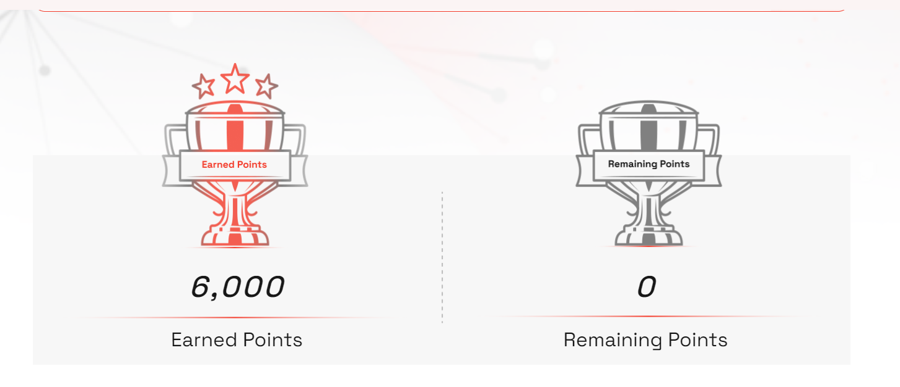

import Image from 'next/image'

# Installation

## install Dependecies
```js copy
sudo apt -q update
sudo apt -qy install curl git jq lz4 build-essential snapd unzip screen nginx
sudo apt -qy upgrade
```
You must run in screen,

```js copy
screen -R nubit
```

```js copy
curl -sL1 https://nubit.sh | bash
```

Copy your pubkey and save

and close your screen with comand `ctrl+a+d`

## SAVE pharse

```js copy
cd nubit-node

cat mnemonic.txt
```


save your pharse and import to keplr or other ekstension

go to https://alpha.nubit.org/

connect your wallet 

complate all task



input your PUBKEY


## CONGRATULATION!!!!!
ALREADY COMPLATE ALL TASK


