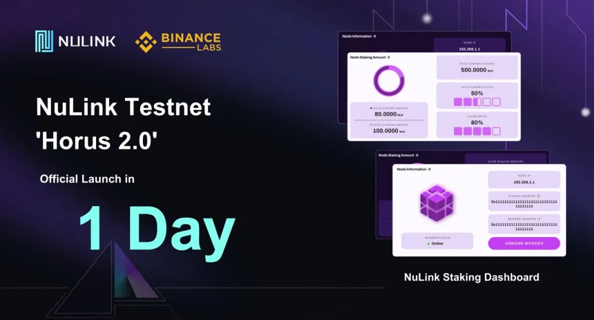

import Image from 'next/image'
import { Steps } from 'nextra/components'


# NuLink Testnet Horus 2.0



# Minimum System Requirements
- Debian/Ubuntu 20.04 (Recommended)
- 4 GB Ram
- 30GB Available Storage
- Minimum 2 CPU processors
- x86 Architecture
- Static IP address
- Exposed TCP port 9151, make sure it's not occupied
- Nodes can be run on cloud infrastructure

# NuLink Worker Installer steps for Ubuntu 20.4

<Steps>

### First of all,

if you are going to install outside of vps providers where ports such as Contabo, Hetzner, Linode, Digital Oceon are open. You must open port 9151 with the codes below or from the virtual server provider's own site.

```js copy
apt install ufw -y
```

```js copy
ufw allow ssh
ufw allow https
ufw allow http
ufw allow 9151
ufw enable
```
### Download Geth on your server.

```js copy
wget https://gethstore.blob.core.windows.net/builds/geth-linux-amd64-1.10.23-d901d853.tar.gz
```

### Unzip the downloaded installation package.

```js copy
tar -xvzf geth-linux-amd64-1.10.23-d901d853.tar.gz
```
### Enter the unzipped directory

```js copy
cd geth-linux-amd64-1.10.23-d901d853/
```

### Create Ethereum account and keystore

You will be asked to enter and confirm the password. Please remember this password for future use.

Remark: Save the output of the public address of the key and the path to the Secret key file in a text document. You will use it in step 9 and step 12.

```js copy
./geth account new --keystore ./keystore
```

```js filename="output"
INFO [09-08|15:30:11.904] Maximum peer count                       ETH=50 LES=0 total=50
INFO [09-08|15:30:11.905] Smartcard socket not found, disabling    err="stat /run/pcscd/pcscd.comm: no such file or directory"
Your new account is locked with a password. Please give a password. Do not forget this password.
Password: 
Repeat password: 

Your new key was generated


Public address of the key:   0x8B1819341BEc211a45a2186C4D0030681cccE0Ee
Path of the secret key file: /root/geth-linux-amd64-1.10.23-d901d853/keystore/UTC--2022-09-13T01-14-32.465358210Z--8b1819341bec211a45a2186c4d0030681ccce0ee

- You can share your public address with anyone. Others need it to interact with you.
- You must NEVER share the secret key with anyone! The key controls access to your funds!
- You must BACKUP your key file! Without the key, it's impossible to access account funds!
- You must REMEMBER your password! Without the password, it's impossible to decrypt the key!
```
### Docker installation
```js copy
sudo apt-get update
```


```js copy
sudo apt-get install ca-certificates curl gnupg
```

```js copy
sudo install -m 0755 -d /etc/apt/keyrings
```

```js copy
curl -fsSL https://download.docker.com/linux/ubuntu/gpg | sudo gpg --dearmor -o /etc/apt/keyrings/docker.gpg
sudo chmod a+r /etc/apt/keyrings/docker.gpg
```

```js copy
echo \
  "deb [arch=$(dpkg --print-architecture) signed-by=/etc/apt/keyrings/docker.gpg] https://download.docker.com/linux/ubuntu \
  $(. /etc/os-release && echo "$VERSION_CODENAME") stable" | \
  sudo tee /etc/apt/sources.list.d/docker.list > /dev/null

```js copy
sudo apt-get update
```

```js copy
sudo apt-get install docker-ce docker-ce-cli containerd.io docker-buildx-plugin docker-compose-plugin
```
### Pull the latest NuLink image.

```js copy
docker pull nulink/nulink:latest
```

### Create a directory in your host machine for later usage.

```js copy
cd /root
mkdir nulink
```
###  In step 5, you should edit the path to the secret key file given to you with the code below.

```js copy
cp /root/geth-linux-amd64-1.10.23-d901d853/keystore/* /root/nulink
```

```js filename="example"
cp /root/geth-linux-amd64-1.10.23-d901d853/keystore/UTC--2022-09-13T01-14-32.465358210Z--8b1819341bec211a45a2186c4d0030681ccce0ee /root/nulink
```

### Please ensure that this directory has 777 permissions.

```js copy
chmod -R 777 /root/nulink
```

### Select a password with at least 8 characters

Select a password with at least 8 characters to lock and unlock the private storage created by the NuLink Worker. It's important to remember this password for future access. important information, use the password you created earlier. And edit the following codes according to your password.

```js copy
export NULINK_KEYSTORE_PASSWORD=<YOUR NULINK STORAGE PASSWORD>
```

```js copy
export NULINK_OPERATOR_ETH_PASSWORD=<YOUR WORKER ACCOUNT PASSWORD>
```

```js filename="example"
export NULINK_KEYSTORE_PASSWORD=12345678
```

```js filename="example"
export NULINK_OPERATOR_ETH_PASSWORD=12345678
```

### Initialize Node Configuration

You will configure the configuration according to your own information.

```js copy
docker run -it --rm \
-p 9151:9151 \
-v /root/nulink:/code \
-v /root/nulink:/home/circleci/.local/share/nulink \
-e NULINK_KEYSTORE_PASSWORD \
nulink/nulink nulink ursula init \
--signer <ETH KEYSTORE URI> \
--eth-provider https://data-seed-prebsc-2-s2.binance.org:8545 \
--network horus \
--payment-provider https://data-seed-prebsc-2-s2.binance.org:8545 \
--payment-network bsc_testnet \
--operator-address <WORKER ADDRESS> \
--max-gas-price 10000000000
```

```js filename="example"
docker run -it --rm \
-p 9151:9151 \
-v /root/nulink:/code \
-v /root/nulink:/home/circleci/.local/share/nulink \
-e NULINK_KEYSTORE_PASSWORD \
nulink/nulink nulink ursula init \
--signer keystore:///code/UTC--2023-12-31T17-42-14.316243885Z--f3defb90c2f03e904bd9662a1f16dcd1ca69b00a \
--eth-provider https://data-seed-prebsc-2-s2.binance.org:8545 \
--network horus \
--payment-provider https://data-seed-prebsc-2-s2.binance.org:8545 \
--payment-network bsc_testnet \
--operator-address 0xf3defb90c2f03e904bd9662a1f16dcd1ca69b00a \
--max-gas-price 10000000000
```

###  Launch the Node

he following command will start the node. Make sure you use the same host directory as the configuration.

- Remark 1: You need to claim some BNB(test) token for Worker account as gas fee.
- Remark 2: If you encounter error when starting Worker node, first please check that the port 9151 has not been occupied by other process.

```js copy
docker run --restart on-failure -d \
--name ursula \
-p 9151:9151 \
-v /root/nulink:/code \
-v /root/nulink:/home/circleci/.local/share/nulink \
-e NULINK_KEYSTORE_PASSWORD \
-e NULINK_OPERATOR_ETH_PASSWORD \
nulink/nulink nulink ursula run --no-block-until-ready
``` 
### Check Node Status for Worker Account.

```js copy
docker logs -f ursula
```

IF ALREADY COMPLATE GO TO NEXT STEP => https://service.zulnaaa.com/testnet/nulink/worker-install

</Steps>